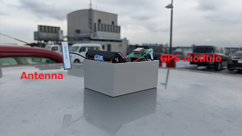
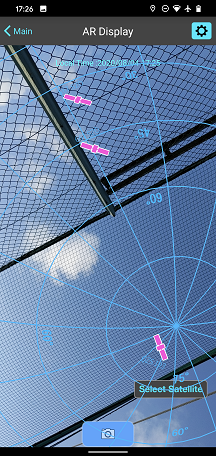

# GPS Tracker


## Goal

- Integration of a GPS module with IEEE802.15.4-based [TWELITE](https://mono-wireless.com/en/index.html) (ZigBee).
- Integration with Google map on Android
- Support InvenSense MPU9255 (nine-axis sensor) to detect human movement

## The reason why I use TWELITE (ZigBee)

- There is no smart phone supporting Bluetooth 5 long range, so I use TWELITE.
- TWELITE is very cheap and easy to prototype an IoT device.

## [Step 1] Evaluation of GPS module

### GPS module

Generaly speaking, GPS modules output standard NEMA sentences in ASCII codes.

In this project, I use this GPS receiver kit that outputs NEMA sentences from UART: http://akizukidenshi.com/catalog/g/gK-09991/

The chipset is [MediaTek MT3339](https://labs.mediatek.com/en/chipset/MT3339).

### NEMA sentences output to PC

I use this small USB-serial module (w/ FTDI chip) quite often: http://akizukidenshi.com/catalog/g/gM-08461/. This kind of USB-serial modules can be seen on Amazon from other makers as well.

I connect the USB-serial module to the GPS module via UART to dump NEMA sentences to study NEMA sentences, so I have designed a case for this evaluation and printed out by my 3D printer.


Its CAD data is [here](https://github.com/araobp/3D-printing/tree/master/gps)

## [Step 2] Evaluation of IEEE802.15.4-based TWELITE

### TWELITE driver for Python

Python is always useful for dumping data from a micro-controller. I have developed TWELITE driver for Python. This script has been quite a useful tool for monitoring data over a TWELITE network in this project.

=> [Code](./python/twelite_driver)

I have also got LoRa modules and BLE modules. In future, I will also try out those wireless communication modules. 

## [Step 3] Integration of GPS, PIC18F25K22, TWELITE and Android (IoT)

### Developing a GPS tracker device

The next step is to integrate the GPS module with PIC 8bit MCU and TWELITE IoT communication module to realize an IoT device of GPS tracker.

One small MOSFETs is added to the circuit for power saving. PIC MCU controls the MOSFET to start/stop the GPS module every 15 seconds (WDT timeout is 15 seconds).

=> [Schematic](./kicad/gnss_logger/gnss_logger.pdf)


==> [Code](../src/pic18f25k22/gps_logger.X)

Since all the components are connected via UART, it is easy to replace those parts with other parts from other makers, such as a LoRa module for example.

### Integration test on GPS NEMA GPGGA sentence

I have tested the board in the following set up:

```
[PC]-USB-[TWELITE MONOSTICK]<-IEEE802.15.4-[TWELITE-DIP]<-UART-[PIC18F25K22]<-UART-[GPS module]
```

The dump from my Python test program is as follows (note: the location is not accurate intentionally and "XX.XXXX" means "MM.MMMM" in the NEMA format):
```
data: b'$GPGGA,022012.000,35XX.XXXX,N,139XX.XXXX,E,1,5,1.80,-5.8,M,39.4,M,,*78', src: 1, seq: 27, lqi: 159
data: b'$GPGGA,022013.000,35XX.XXXX,N,139XX.XXXX,E,1,5,1.80,-6.2,M,39.4,M,,*70', src: 1, seq: 28, lqi: 150
data: b'$GPGGA,022014.000,35XX.XXXX,N,139XX.XXXX,E,1,5,1.80,-6.6,M,39.4,M,,*7D', src: 1, seq: 29, lqi: 159
data: b'$GPGGA,022015.000,35XX.XXXX,N,139XX.XXXX,E,1,5,1.80,-7.0,M,39.4,M,,*74', src: 1, seq: 30, lqi: 162
                        :
```

### Android app for tracking the IoT device

I use Pixel4 these days for developing IoT app on Android.

This is a simple Android app to track the device.


TWELITE MONOSTICK is connected to Pixel4 via my [USB-OTG cable](https://www.amazon.co.jp/gp/product/B0798ML56T).


Protocol stack of the driver part of the Android app:

```
    [  Android app  ]  Android (Pixel4)
    [  NEMA parser  ]
    [  TWELITE      ]
    [  FTDI driver  ]
           |
      USB-OTG/UART
           |
    [  FTDI chip    ]  MONOSTICK
    [ TWELITE chip  ] 
      IEEE802.15.4
```

Android works as USB host in this case:

=> [Code](./android/nema_dump)

### Etc

I have also developed a TWELITE message dump app for android:

=> [Code](./android/twelite_dump)

### Field test

- On July 30th, 2020

The test was to check if the GPS tracker can be used for finding my car in a parking lot:




The Android app could find my car 80 meters away.


- On August 4th, 2020

This time, the weather was quite fine, and I put the GPS tracker in my backpack so that the position of GPS antenna is high enough from the ground.


Japanese GPS satelites (QZSS, "Michibiki") were in the sky (observed via ["GNSS view"](https://play.google.com/store/apps/details?id=com.nec.android.qzss.gnssview&hl=en) app)



The accuracy of location is quite good: a few meters. 

### Accuracy

- Good visibility to the sky, clear sky and dry air: a few meters
- Bad visibility to the sky, cloudy and moist air: around or over 10 meters

## [Step 4] Integration of InvenSense (TDK) MPU-9255 (WORK IN PROGRESS)

Reuse my work in this porject: https://github.com/araobp/pic16f1-mcu/blob/master/src/pic16f18326/motion_sensor.X/mpu9250.c

Note: the product status of InvenSense MPU-9250 (incl. MPU-9255) is EOL: https://invensense.tdk.com/products/motion-tracking/9-axis/

Accelerometer and Gyroscope
- Sampling rate: 80Hz (Nyquist frequency: 40Hz)
- Low-pass filter: 41Hz (the built-in LPF)

Mangetometer
- Sampling rate: 4Hz

## Reference

[NEMA reference] http://www.gpsinformation.org/dale/nmea.htm

The following is a quote from the reference above:

```
$GPGGA,123519,4807.038,N,01131.000,E,1,08,0.9,545.4,M,46.9,M,,*47

Where:
     GGA          Global Positioning System Fix Data
     123519       Fix taken at 12:35:19 UTC
     4807.038,N   Latitude 48 deg 07.038' N
     01131.000,E  Longitude 11 deg 31.000' E
     1            Fix quality: 0 = invalid
                               1 = GPS fix (SPS)
                               2 = DGPS fix
                               3 = PPS fix
			       4 = Real Time Kinematic
			       5 = Float RTK
                               6 = estimated (dead reckoning) (2.3 feature)
			       7 = Manual input mode
			       8 = Simulation mode
     08           Number of satellites being tracked
     0.9          Horizontal dilution of position
     545.4,M      Altitude, Meters, above mean sea level
     46.9,M       Height of geoid (mean sea level) above WGS84
                      ellipsoid
     (empty field) time in seconds since last DGPS update
     (empty field) DGPS station ID number
     *47          the checksum data, always begins with *
```
