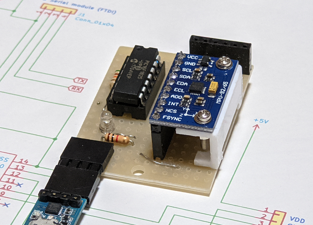
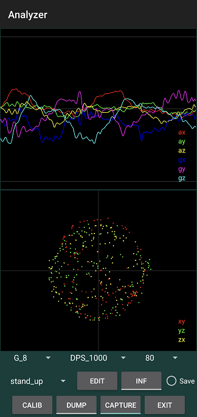

# Oscilloscope for 9-axis sensor (PIC1825 with MPU9250 and Android)



## Background

Last year, Microchip released a new I2C library that is generated by MCC automatically. I have not swiched from the old verion to the new version yet.

In this project, I evaluate the new library with InvenSense (TDK) MPU9250 9-axis sensor that can be purchased from Amazon.com at a very reasonable price.

```
 [InvenSense MPU-9255 (HiLetgo MPU9250 module)]--I2C--[PIC16F1825]--USB serial--[TeraTerm on Win10 PC]

```

I also develop an Android app to visualize data from MPU9250.
```
 [InvenSense MPU-9255 (HiLetgo MPU9250 module)]--I2C--[PIC16F1825]--USB serial--[Android app]

```

## I2C driver generated by MCC

Although this driver is generated as **an example of I2C driver implementation** by MCC, these APIs are easy to understand and work very well for basic I2C operations.

```
#include <stdint.h>
#include <stdio.h>
#include "../i2c_master.h"

uint8_t  I2C_Read1ByteRegister(i2c_address_t address, uint8_t reg);
uint16_t I2C_Read2ByteRegister(i2c_address_t address, uint8_t reg);
void I2C_Write1ByteRegister(i2c_address_t address, uint8_t reg, uint8_t data);
void I2C_Write2ByteRegister(i2c_address_t address, uint8_t reg, uint16_t data);
void I2C_WriteNBytes(i2c_address_t address, uint8_t *data, size_t len);
void I2C_ReadNBytes(i2c_address_t address, uint8_t *data, size_t len);
void I2C_ReadDataBlock(i2c_address_t address, uint8_t reg, uint8_t *data, size_t len);
```

## InvenSense (TDK) MPU-9250/9255

The module I purchased from Amazon is MPU-9255. The module includes an accelerometer, a gyroscope and a mangetometer from Asahi Kasei.

## Schematic

[Schematic](./kicad/i2c_lib_eval/i2c_lib_eval.pdf)

The universal board has 14 holes x 17 holes.

## Code 

I use I2C bus to access all the sensors in the module.

==> [Code for PIC16F1825](./src/pic16f1825/i2c_lib_eval.X)

==> [Code for Android](./android/mpu9250)

## Android app screen shots



## References

- [Magnetometer calibration](https://github.com/kriswiner/MPU6050/wiki/Simple-and-Effective-Magnetometer-Calibration)


