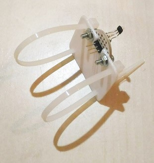

# Motion logger with PIC16F18326, MPU9255, A1324LUA-T and EEPROM

I develop a small 9-axis motion logger with [PIC16F18326](http://ww1.microchip.com/downloads/en/DeviceDoc/40001839B.pdf) and [MPU9255](https://stanford.edu/class/ee267/misc/MPU-9255-Datasheet.pdf).

Typical applications in this project:
- measuring ride quality of public transport
- wearable/embeddeable motion sensor for sports

Note1: the MPU9250 sensor module I purchased from Amazon turned out to be MPU9255, because WHO_AM_I response is 0x73.
Note2: [MPU9250(incl. 9255) is not recommended for new designs](https://www.invensense.com/products/motion-tracking/9-axis/).

#### Datasheet

- [8bit MCU "PIC16F18326"](http://ww1.microchip.com/downloads/en/DeviceDoc/40001839B.pdf)
- [Nine-axis motion detector "MPU9255"](https://stanford.edu/class/ee267/misc/MPU-9255-Datasheet.pdf)
- [Hall sensor "A1324LUA-T"](https://www.allegromicro.com/~/media/Files/Datasheets/A1324-5-6-Datasheet.ashx)
- [EEPROM "AT24C256B"(256kbits)](http://akizukidenshi.com/download/at24c256b.pdf)

#### Project documentation

- [Specification draft](https://docs.google.com/presentation/d/e/2PACX-1vS1QRvp0iwG9tbEkca-ZsDFF7-tqjf2MM4x4-hfQBJTx4DSAqnX8e7i9MFr4HT65ORehIFEavOaND_r/pub?start=false&loop=false&delayms=3000)
- [Motion sensor schematic (main board)](./kicad/motion_detector/motion_detector.pdf)
- [Speed sensor schematic (I2C slave device)](./kicad/speed_sensor/speed_sensor.pdf)
- [Speed sensor CAD data for 3D printer](./freecad/speed_pulses.stl)

#### Code in development

- [Motion sensor](./src/pic16f18326/motion_sensor.X)
- [Speed sensor](./src/pic16f18326/speed_sensor.X)

#### Preliminary test on MPU9255

- [Acceleration and angular velocity of a train (Jupyter Notebook)](./jupyter/motion_in_a_train.ipynb)
- [Free fall (Jupyter Notebook)](./jupyter/motion_sensor_free_fall.ipynb)

#### Deep learning with Keras/TensorFlow

I use the instrument to record data as an input for machine learning (training and testing):
- [CNN on Keras/TensorFlow](./tensorflow/machine_learning_CNN_Keras.ipynb)
