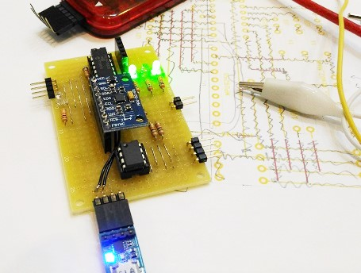
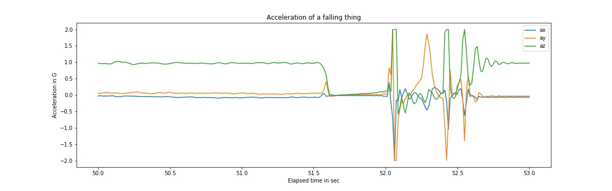

# PIC16F1 as measuring instruments for learning Physics

## Background

Use [PIC16F1 DIP (14 pins, such as PIC16F18326 or PIC16F1825)](http://microchipdeveloper.com/mcu1102:start) to develop a measuring instrument for learning Physics. It is very small and very cheap, but it has a lot of capabilities comparable to Arduino.

#### My original PIC16F1 evaluation board

I developed my original PIC16F1 evaluation board in 2017, and I have used this board for a number of IoT demonstrations so far. When a demo is expected to be small and simple, the board is more useful than other commercial boards such as Arduino or STM32 Nucleo. The total cost of the board (~ $10) is much cheaper than Arduino Uno.

I usually use the board with RasPi or Android for IoT demo, but I use it as a stand-alone system for physics experiments this time.

#### Communications

I developed I2C-based plug & play protocol and CAN driver for the evaluation board as well:
- [I2C-based plug & play protocol](https://github.com/araobp/sensor-network)
- [CAN driver](https://github.com/araobp/can-bus)

## [Instrument 1] Motion sensor with PIC16F18326, MPU9255 and A1324LUA-T

I will develop a small 9-axis sensor unit with [PIC16F18326](http://ww1.microchip.com/downloads/en/DeviceDoc/40001839B.pdf) and [MPU9255](https://stanford.edu/class/ee267/misc/MPU-9255-Datasheet.pdf). I will use this for experiments of mechanics (physics).

Typical applications in this project:
- measuring ride quality of public transport
- wearable/embeddeable motion sensor for sports

Note1: the MPU9250 sensor module I purchased from Amazon turned out to be MPU9255, because WHO_AM_I response is 0x73.
Note2: [MPU9250(incl. 9255) is not recommended for new designs](https://www.invensense.com/products/motion-tracking/9-axis/).

#### Datasheet

- [8bit MCU "PIC16F18326"](http://ww1.microchip.com/downloads/en/DeviceDoc/40001839B.pdf)
- [Nine-axis motion detector "MPU9255"](https://stanford.edu/class/ee267/misc/MPU-9255-Datasheet.pdf)
- [Hall sensor "A1324LUA-T"](https://www.allegromicro.com/~/media/Files/Datasheets/A1324-5-6-Datasheet.ashx)
- [EEPROM "AT24C256B"(256kbits)](http://akizukidenshi.com/download/at24c256b.pdf)

#### Documentation

- [Specification draft](https://docs.google.com/presentation/d/e/2PACX-1vS1QRvp0iwG9tbEkca-ZsDFF7-tqjf2MM4x4-hfQBJTx4DSAqnX8e7i9MFr4HT65ORehIFEavOaND_r/pub?start=false&loop=false&delayms=3000)
- [Motion sensor schematic (main board)](./kicad/motion_detector/motion_detector.pdf)
- [Speed sensor schematic (I2C slave device)](./kicad/speed_sensor/speed_sensor.pdf)

#### Code in development

- [Motion sensor](./src/pic16f18623/motion_sensor.X)
- [Speed sensor](./src/pic16f1825/speed_sensor.X)

#### Preliminary test on MPU9255

- [Acceleration and angular velocity of a train (Jupyter Notebook)](./jupyter/motion in a train.ipynb)
- [Free fall (Jupyter Notebook)](./jupyter/motion_sensor_free_fall.ipynb)

## [Instrument 2] Measuring heat conduction with thermistor

I use "A/D converter to UART bridge" developed in [my other project on github.com](https://github.com/araobp/motion-detector).

Thermistor:
- [103AT-2](http://akizukidenshi.com/catalog/g/gP-07258/)
- [103AT-11](http://akizukidenshi.com/catalog/g/gP-07257/)

## [Instrument 3] Atmospheric pressure and temperature sensor with MPL115A1 and thermistor

Experiments on Boyle's law and Charles's law

## [Instrument 4] GPS and inertial navigation

I have already developed a GPS gadget [in this project](https://github.com/araobp/gps_android). I will add an [inertial navigation system](https://en.wikipedia.org/wiki/Inertial_navigation_system) to the gadget.

## Tips

#### Microchip XC8 C compiler

C standard "C99" does not allow some of MCC-generated code. Change the setting to "C90".

#### Atmel EEPROM

Data addresses for page write must be 64^n.
