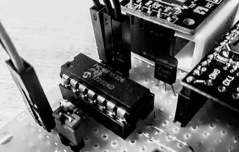
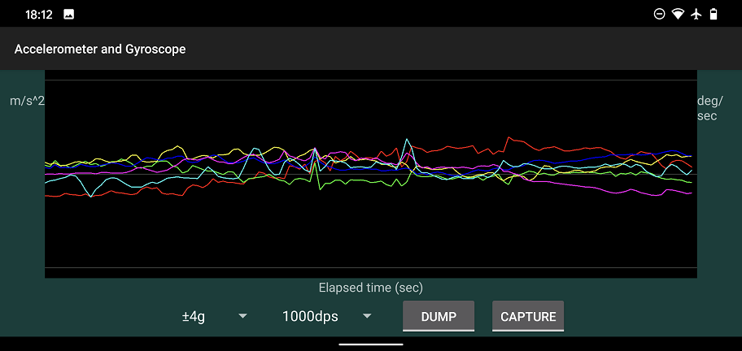
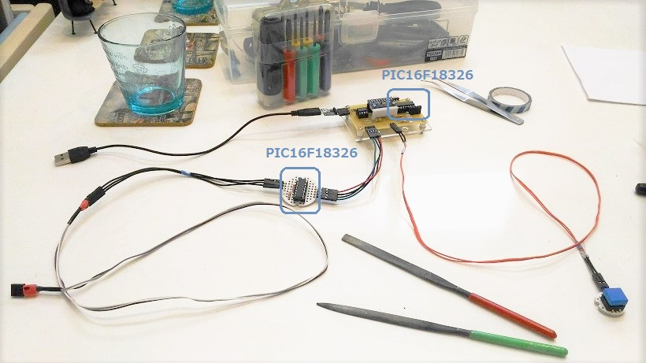
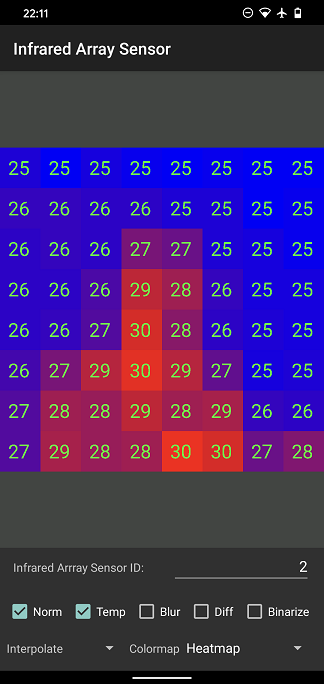
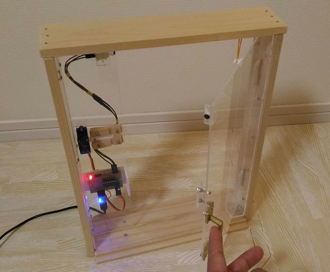

# Application components for Microchip PIC MCUs

## Background and motivation

In the past years, I have used a lot of the following MCUs in my successful IoT projects at work:
- PIC1825
- PIC1829
- PIC18326
- PIC18F25K22

## Application components

### Oscilloscope for nine-axis sensor (PIC16F1825 with MPU9250 and Android)

=> **[Project page](I2C_LIB_EVAL.md)**

### Motion logger for sensing human body movement (PIC16F18326)

=> **[Project page](MOTION_LOGGER.md)**

### Wireless network of infrared array sensors with TWELITE (PIC16F18326)

=> **[Project page](TWELITE.md)**

### Door controller (PIC16F1825)

=> **[Project page](DOOR_CONTROLLER.md)**

## Tips

#### Microchip XC8 C compiler

C standard "C99" does not allow some of MCC-generated code. Change the setting to "C90".

#### Atmel EEPROM

Data addresses for page write must be 64^n.
