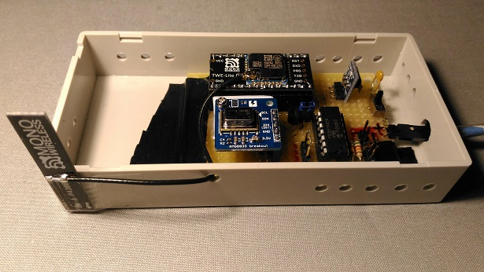
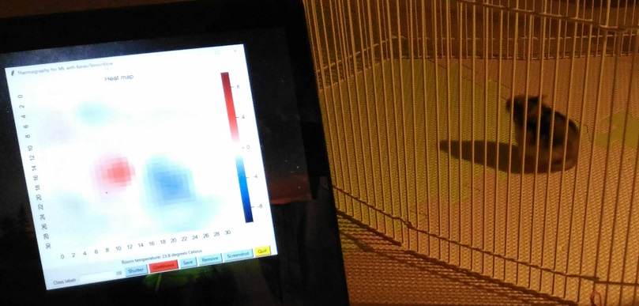

# Wireless network of infrared array sensors with TWELITE



## Goal

I develop an algorithm on PIC16F1 to infer motion of moving objects. The inference result is transferred to PC over TWELITE wireless sensor network.

I assume that the targe object is animals in this project.

## Hardware components

### TWELITE

[TWELITE](https://mono-wireless.com/en/) is a low-power wireless communication module based on IEEE802.15.4. Its core is 32bit MCU ["JN5164"](https://www.nxp.com/jp/products/wireless/proprietary-ieee-802.15.4-based/zigbee-and-ieee802.15.4-wireless-microcontroller-with-160-kb-flash-32-kb-ram:JN5164) from NXP.

Note: I have noticed that TWELITE is succeptible to radio interference.

### Infrared array sensor (Panasonic AMG8833)

I use [AMG8833](https://cdn-learn.adafruit.com/assets/assets/000/043/261/original/Grid-EYE_SPECIFICATIONS%28Reference%29.pdf?1498680225
) from Panasonic.

## Why I use PIC16F1 with TWELITE

I need to transfer 64 pixel images (128 bytes data per frame, 10 FPS) over TWELITE.

TWELITE provides SDK for developing an application, but a single core CPU cannot tolerate a relatively longer blocking time of I/O processing.

The SDK supports event-driven APIs to cope with such a problem, but I guess the CPU still cannot satisfy the requirement.

I use 8bit MCU as a co-processor of TWELITE for receiving data from an infrared array sensor on I2C bus, apply filters to extract features, and transfer the features to TWELITE via UART.

## Specification of the co-processor (PIC16F18326)

|          | Value                    |
|----------|--------------------------|
|VDD       | 3.3V DC                  |
|Power consumption| a few mA          |
|CPU Clock | 32MHz HF                 |
|UART      | 115200bps                |
|I2C Clock | 250kHz                   |

Note1: I tried lower CPU clock frequencies, but UART did not work with TWELITE-DIP.
Note2: Measured temperature on AMS1117(LDO) at 30mA is under 40 degrees Celsius (ambient temeprature: 26 degrees Celsius).

## 8bit quantization

- Payload size of TWELITE's packet is 80, so I need to compress the image data.
- The infrared array sensor outputs temperature data of each pixel in a range of 0 to 80 degreees Celsius.
- Room temperature is usually in a range of 10 to 40.

So I just ignore MSB bytes from the sensor, and transfer LSB bytes to TWELITE. I use 0xFF as a delimiter of data.

Temperature range: 0 - 63.5 degrees Celsius (63.5/0.25 = 0xfe)

Note: the sensor also outputs temperature data from a thermistor on the chip. I transfer both MSB and LSB in this case.

## Extracting features for motion detection



### Features for example

Diff output between frames emphasizes edges of moving objects, and the diff value corresponds to their speed (vector).

```
Diff at each column
^
|                     _
|                    /  \
|                   /    \  ===> Direction of movement
0   --       ------       ------
|      \    /
|       \__/
|
+------------------------------------>
                                    time
```

Here I assume that objects are moving along the column direction (column-wise: upward or downward).

In general, it is possible to detect the motion in that condition by applying a filter, like the wave above, to diff between frames.

Such a filter:

```
  Pattern matching
  (sine-wave-like)

    P..             P: Positive value, N: Negative value
 0        0..         0   ==> match
                N..


P matched if the current value is positive (and larger than some threshold).

N matches under the following conditions:
- previous values (at least one) matched P:
- the current diff value is negative and smaller than some threashold.

If P and N mathced, it outputs 1. N matching is repeated multiple times.
If only P matched, it outpus 0 (the output is discared).

```

## Command sequence

### Reactive mode

```
 PIC16F18326
 (as server)          Client
     |                  |     Time taken for the operation (approx.)
     |<----- 'p' -------|        10msec
     |---- pixels ----->|        50msec
     |        :         |
     |<----- 't' -------|        10msec
     |--- thermistor -->|        15msec
     |        :         |
```

The bottle neck of data transfer is the following:
- I2C (250kHz = 250kbps)
- UART (115200bps)
- IEEE802.15.4 PHY (250kbps)
- And buffering at each interface

#### Commands

| Command | Description                            | Response data length| Data type      |
|---------|----------------------------------------|-----------|-----------|
| t       | thermistor                             | 2 bytes   | uint8_t   |
| p       | 64 pixels                              | 64 bytes  | uint8_t   |
| d       | 64 pixels diff between previous frame and current frame | 64 bytes  | int8_t    |
| m       | column-wise motion detection           | 64 bytes  | int8_t    |
| M       | motion count on a specific row         | 8 bytes   | int8_t    |
| n       | enable notifications (passive mode)    | NA        | NA        |
| N       | disable notifications (reactive mode)  | NA        | NA        |
| s       | dump setting paramters                 | 2 bytes   | uint8_t   |
| 0 - 6   | calibrate motion detection threshold   | NA        | NA        |

### Passive mode

```
 PIC16F18326
 (as server)          Client
     |                  |
     |-- notify event ->|
     |        :         |
     |-- notify event ->|
     |        :         |
```

#### Notifications

8 bytes (int8_t) data is sent from a slave node to a master node to notify that animals are moving across a line.

Example: detecting animals moving along a corridor

```

      Corrider
   |             |
   |             |
   |  Animal ^   |
   | - | - - | - | Line
   |   V  Animal |
   |             |
   |             |

```

## Power saving

PIC16F1 controls FET (Fairchild BS170) for saving power.


## Circuit and its schematic

### Specification

The following values are measured with my analog tester.

|Parameter         |Measured Value                      |
|------------------|------------------------------------|
|Power supply      | 1.5V battery x 4 = 6V              |
|Current           | 30mA (active) or 5mA (sleep)       |
|Power consumption | 6V x 30mA = 180mA                  |
|Internal current (TWELITE and AMG8833) | 25mA between headers adjacent to FET|
|VDD-GND voltage at PIC16F18326  | 3.4V                 |
|VCC-GND voltage at TWELITE-DIP or AMG8833 | 3.3V       |
|Temperature at LDO w/o heatsink| 31 degrees Celsius (at ambient temperature 27 degrees Celsius) |

### Schematic

- [I2C adaptor for TWELITE-DIP](./kicad/i2c_adaptor/i2c_adaptor.pdf)

Note: "J1" (Jumper 1) is a jumper pin as a power management flag:
- Jumper pin is on: power management is disabled (= pulled down to GND).
- Jumper pin is off: power management is enabled (= pulled up to 3.3V).

## Code

- [Master(Python) with TWELITE-STICK](./python/twelite)
- [Slave(PIC16F18326) with TWELITE-DIP](./src/pic16f18326/amg8833.X)

### Test

#### All kinds of data (in reactive mode)

```
> python .\main.py -d 2 -l 1 COM9
--- SLAVE 2 ---
<room temperature> 22.4375 degrees Celsius
--- SLAVE 2 ---
<64 pixels>
19.2 19.2 20.2 20.2 20.0 20.5 20.8 20.5
19.5 19.2 19.8 19.8 20.2 20.8 20.8 21.8
19.8 19.2 20.2 20.2 20.0 20.5 20.8 22.5
19.8 19.5 20.0 21.2 21.0 21.0 20.8 21.8
19.5 20.5 20.5 23.0 24.0 20.8 20.5 21.2
19.8 19.8 20.2 20.8 21.2 20.5 20.8 21.5
19.5 19.2 20.2 20.0 20.0 20.5 21.0 23.2
19.2 19.5 20.0 19.5 19.8 20.0 20.2 22.8
--- SLAVE 2 ---
<64 pixels diff>
 0.0  0.2  0.2  0.0 -0.2  0.0  0.0  0.0
 0.2 -0.2 -0.2  0.0 -0.5  0.2 -0.2  0.5
 0.0 -0.5  0.0  0.0 -0.2 -0.2 -0.2  0.0
 0.2 -0.2 -0.2  0.2  0.0  0.5 -0.2  0.5
-0.2  0.5  0.0 -0.2  0.0 -0.2  0.0 -0.2
-0.2  0.2  0.2 -0.2  0.2 -0.2  0.0 -0.2
-0.2  0.2  0.2 -0.2  0.2 -0.5  0.0  0.2
-0.2  0.5  0.0  0.2  0.0  0.0  0.2  0.5
--- SLAVE 2 ---
<motion detection>
   0    0    0    0    0    0    0    0
   0    0    0    0    0    0    0    0
   0    0    0    0    0    0    0    0
   0    0    0    0    0    0    0    0
   0    0    0    0    0    0    0    0
   0    0    0    0    0    0    0    0
   0    0    0    0    0    0    0    0
   0    0    0    0    0    0    0    0
--- SLAVE 2 ---
<motion count>
   0    0    0    0    0    0    0    0
--- STATS ---
Elapsed time: 0.284 sec
Average interval: 283.8 msec
Tranmission error: 0 times
```

#### Motion detection (in reactive mode)

```
> python .\main.py -d 2 -m -l 1 COM9
--- SLAVE 2 ---
<motion detection>
   0    0    0    0    0    0    0    0
   0    0    0    0    0    0    0    0
   0    0    0    0    0    0    0    0
   0    0    0    1    1    1    1    0
   0    0    0    1    1    1    1    0
   0    0    0    0    0    0    0    0
   0    0    0    0    0    0    0    0
   0    0    0    0    0    0    0    0
               :
```

```
> python .\main.py -d 2 -l 10000 -M -D 50 COM9
[07:49:55] src: 2 | 0  0  0  0  0 -1  0  0 |
[07:49:58] src: 2 | 0  0  1  0  0  0  0  0 |
               :
```
#### Receiving notifications of motion detection (in passive mode)

```
> python .\main.py -d 2 -n COM9
> python .\main.py -d 2 -c COM9
[07:39:33] src: 2 |             B  |
[07:39:36] src: 2 |           F    |
[07:39:41] src: 2 |             B  |
[07:39:42] src: 2 |           B    |
[07:39:47] src: 2 |   B            |
[07:40:02] src: 2 |             F  |
[07:40:08] src: 2 |   F            |
             :
```

## Configuration of TWELITE-DIP

The following is a configuration of TWELITE slave (ID=2):
```
--- CONFIG/TWE UART APP V1-02-15/SID=0x810d0823/LID=0x02 -E ---
 a: set Application ID (0x67720103)
 i: set Device ID (2=0x02)
 c: set Channels (11,16,21)
 x: set RF Conf (3)
 r: set Role (0x0)
 l: set Layer (0x1)
 b: set UART baud (115200)
 B: set UART option (8N1)
 m: set UART mode (B)
 h: set handle name []
 C: set crypt mode (1)
 K: set crypt key [h**k*******]
 o: set option bits (0x00000000)
---
 S: save Configuration
 R: reset to Defaults
 ```
 
## Reference

- https://mono-wireless.com/jp/products/TWE-APPS/App_Uart/mode_format.html
