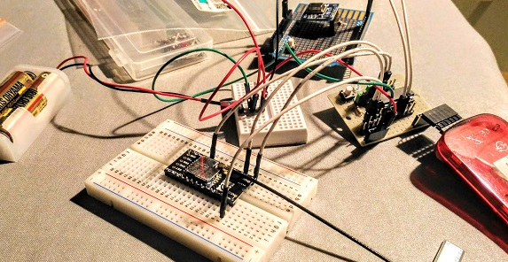

# Wireless network of infrared array sensors with TWELITE



## Goal

I develop an algorithm on PIC16F1 to infer motion of moving objects. The inference result is transferred to PC over TWELITE wireless sensor network.

## Hardware components

### TWELITE

[TWELITE](https://mono-wireless.com/en/) is a low-power wireless communication module based on IEEE802.15.4. Its core is 32bit MCU ["JN5164"](https://www.nxp.com/jp/products/wireless/proprietary-ieee-802.15.4-based/zigbee-and-ieee802.15.4-wireless-microcontroller-with-160-kb-flash-32-kb-ram:JN5164) from NXP.

### Infrared array sensor (Panasonic AMG8833)

I use [AMG8833](https://cdn-learn.adafruit.com/assets/assets/000/043/261/original/Grid-EYE_SPECIFICATIONS%28Reference%29.pdf?1498680225
) from Panasonic.

## Why I use PIC16F1 with TWELITE

I need to transfer 64 pixel images (128 bytes data per frame, 10 FPS) over TWELITE.

TWELITE provides SDK for developing an application, but a single core CPU cannot toralate a relatively longer blocking time of I/O processing.

The SDK supports event-driven APIs to cope with such a problem, but I guess the CPU still cannot satisfy the requirement.

I use 8bit MCU as a co-processor of TWELITE just for receiving data from an infrared array sensor on I2C bus and transfer the data to TWELITE via UART.

## Specification of the co-processor (PIC16F18326)

|          | Value                    |
|----------|--------------------------|
|VDD       | 3.0V DC (AAA battery x 2)|
|Power consumption| a few mA          |
|CPU Clock | 32MHz HF                 |
|UART      | 115200bps                |
|I2C Clock | 250kHz                   |

Note: I tried lower CPU clock frequencies, but UART did not work with TWELITE-DIP.

## 8bit quantization

- Payload size of TWELITE's packet is 80, so I need to compress the image data.
- The infrared array sensor outputs temperature data of each pixel in a range of 0 to 80 degreees Celsius.
- Room temperature is usually in a range of 10 to 40.

So I just ignore MSB bytes from the sensor, and transfer LSB bytes to TWELITE. I use 0xFF as a delimiter of data.

Temperature range: 0 - 63.5 degrees Celsius (63.5/0.25 = 0xfe)

Note: the sensor also outputs temperature data from a thermistor on the chip. I transfer both MSB and LSB in this case.

## Feature extraction on PIC16F1

In spite of 8bit quantization, the load on TWELITE is still heavy. It may require further processing to calculate features on PIC16F1 before transmitting the data to the master node.

### Features for example

#### A: Diff

Diff between the current value and the previous value for each pixel.

#### B: Sum of diff along each row

Diff average along each row.

#### C: Sensing motion of moving objects

Diff output emphasizes edges of moving objects, and the diff value corresponds to their speed (vector).

```
Diff at each column
^
|                     _
|                    /  \
|                   /    \  ===> Direction of movement
0   --       ------       ------
|      \    /
|       \__/
|
+------------------------------------>
                                    time
```

Here I assume that objects are moving along the column direction (upward or downward).

In general, it is possible to detect the motion in that condition by applying a filter, like the wave above, to output from A: Diff. 

Such a filter:

```
  Pattern matching
  (sine-wave-like)

    P..             P: Positive value, N: Negative value
 0        0..         0   ==> match
                N..


P matched if the current value is positive (and larger than some threshold).

N matches under the following conditions:
- previous values (at least one) matched P:
- the current diff value is negative and smaller than some threashold.

If P and N mathced, it outputs 1. N matching is repeated multiple times.
If only P matched, it outpus 0 (the output is discared).

```

```
    Moving objects
                   ^
                   |
    ^             -o-
    |
   -o-
                
Objects moving upward      Filtering                 Peaks row-wise  Peak values  Peaks column-wise
 0  1  0  0  0  0  1  0    0  0  0  0  0  0  0  0         0               0            0
 2  2  2  1  0  1  2  1    0  0  0  0  0  0  0  0         0               0            0
 0  0  0  0  0  0  0  0    0  0  0  0  0  0  0  0         0               0            0
-1 -2 -2  0  0 -1 -2 -1    1  1  1  0  0  1  1  1         2               6            2
 0 -1 -1  0  0  0 -1  0    0  1  1  0  0  0  1  0         2               3          [ 0 ] <== scanning point
 0  0  0  0  0  0  0  0    0  0  0  0  0  0  0  0         0               0            0
 0  1  1  0  0  0  0  0    0  0  0  0  0  0  0  0         0               0            0
 0  1  1  1  0  0  0  0    0  0  0  0  0  0  0  0         0               0            0

                           0  0  0  0  0  0  0  0         0               0            0
                           0  0  0  0  0  0  0  0         0               0            0
                           0  0  0  0  0  0  0  0         0               0            0
                           0  0  0  0  0  1  1  1         1               3            0
                           1  1  1  0  0  0  1  0         2               4          [ 2 ] <== scanning point
                           0  1  1  0  0  0  0  0         1               2            0
                           0  0  0  0  0  0  0  0         0               0            0
                           0  0  0  0  0  0  0  0         0               0            0

                           0  0  0  0  0  0  0  0         0               0            0
                           0  0  0  0  0  0  0  0         0               0            0
                           0  0  0  0  0  1  1  1         1               3            0
                           0  0  0  0  0  1  1  1         1               3            0
                           0  1  1  1  0  0  0  0         1               3          [ 2 ] <== scanning point
                           0  1  1  0  0  0  0  0         1               2            0
                           0  0  1  0  0  0  0  0         1               1            0
                           0  0  0  0  0  0  0  0         0               0            0
```

In this method, the slave node application on PIC16F1 sends only 1 byte info to the master node over TWELITE.

```

      bits
| | | | | | | | |
|S|NUM  |S|NUM  |    S: sign bit, NUM: 0 ~ 7
Downward Upward

```

## Command sequence

This command sequence (polling) is optimized for decreasing the power consumption.

```
 PIC16F1825           
 (as server)          Client
     |                  |     Time taken for the operation (approx.)
     |<----- 'p' -------|        10msec
     |---- pixels ----->|        50msec
     |        :         |
     |<----- 't' -------|        10msec
     |--- thermistor -->|        15msec
     |        :         |
```

The bottle neck of data transfer is the following:
- I2C (250kHz = 250kbps)
- UART (115200bps)
- IEEE802.15.4 PHY (250kbps)
- And buffering at each interface

## Commands

| Command | Description                            | Data size | Request          | Response        |
|---------|----------------------------------------|-----------|------------------|-----------------|
| h       | hello                                  |           | Slave -> Master  | r(un)           |
| r       | run                                    |           | Master -> Slave  |                 |
| k       | keep on (reset the timer)              |           | Master -> Slave  | (none)          |
| t       | thermistor                             | 2 bytes   | Master -> Slave  | data            |
| p       | 64 pixels                              | 64 bytes  | Master -> Slave  | data            |
| d       | 64 pixels diff                         | 64 bytes  | Master -> Slave  | data            |
| D       | avarages of diff of each rows          | 8 bytes   | Master -> Slave  | data            |
| f       | output via the filter                  | 1 byte    | Master -> Slave  | data            |

## Power saving

PIC16F1 controls FET (Fairchild BS170) for saving power.


## Code

- [Master(Python) with TWELITE-STICK](./python/twelite)
- [Slave(PIC16F18326) with TWELITE-DIP](./src/pic16f18326/amg8833.X)

Test:
```
--- SLAVE 1 ---
 length: 2, seq number: 34, LQI: 144
 room temperature: 19.125 degrees Celsius

 length: 64, seq number: 35, LQI: 147
 pixels: 16.25,16.5,16.75,16.5,16.25,16.25,16.25,16.5,16.25,16.5,16.25,16.75,16.75,15.75,16.0,16.25,16.25,16.0,16.5,16.5,16.0,15.75,16.0,16.5,16.0,16.25,16.0,16.5,16.0,15.5,15.75,17.0,16.0,16.75,16.0,15.75,16.25,15.25,15.5,16.25,16.75,16.75,16.5,16.0,16.5,16.0,16.25,16.0,15.75,16.75,16.0,15.5,15.75,16.25,16.25,15.5,16.0,16.0,15.0,15.25,15.5,15.5,15.25,15.25 degrees Celsius

--- SLAVE 1 ---
 length: 2, seq number: 36, LQI: 147
 room temperature: 19.1875 degrees Celsius

 length: 64, seq number: 37, LQI: 147
 pixels: 16.25,16.5,17.0,16.75,16.25,16.25,16.25,16.25,16.0,16.25,16.25,16.5,16.5,16.25,15.75,16.25,16.25,16.25,16.75,16.75,16.25,15.75,16.0,16.75,16.25,16.25,16.0,16.25,16.0,15.0,15.5,16.5,16.0,16.75,16.25,16.0,16.5,15.5,15.75,16.5,16.5,16.75,16.5,16.0,16.25,16.25,16.25,16.25,15.5,16.75,15.75,15.5,16.25,16.0,15.25,15.75,15.5,15.5,14.75,14.75,15.75,15.5,15.75,15.5 degrees Celsius
 
                            :
```

## Reference

- https://mono-wireless.com/jp/products/TWE-APPS/App_Uart/mode_format.html
